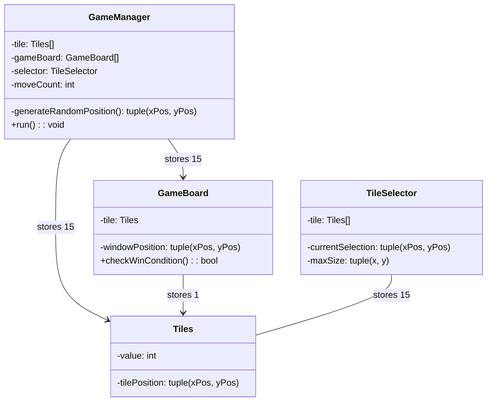

```mermaid
classDiagram
	class GameManager {
		-tile: Tiles[]
		-gameBoard: GameBoard[]
		-selector: TileSelector
		-moveCount: int
		-generateRandomPosition(): tuple(xPos, yPos)
		+run(): void
	}

	class GameBoard {
		-tile: Tiles
		-windowPosition: tuple(xPos, yPos)

		+checkWinCondition(): bool
	}

	class Tiles {
		-tilePosition: tuple(xPos, yPos)
		-value: int
	}

	class TileSelector {
		-tile: Tiles[]
		-currentSelection: tuple(xPos, yPos)
		-maxSize: tuple(x, y)
	}
	GameManager --> Tiles: stores 15
	GameManager --> GameBoard: stores 15
	GameBoard --> Tiles: stores 1
	TileSelector --Tiles: stores 15

```