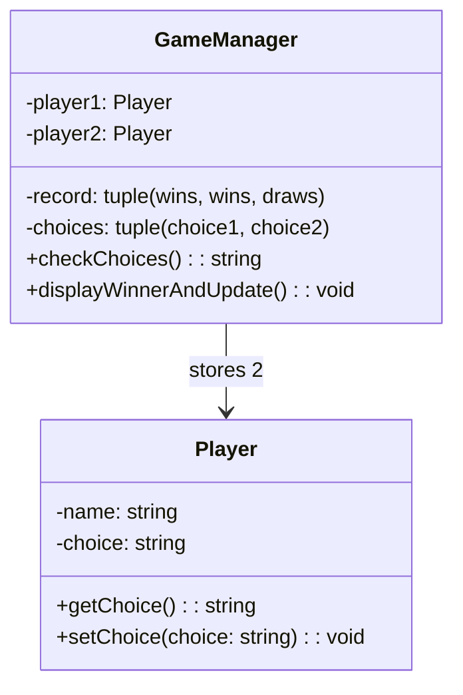

```mermaid
classDiagram
    class Player {
        -name: string
        -choice: string
        +getChoice(): string
        +setChoice(choice: string): void
    }
    
    class GameManager {
        -player1: Player
        -player2: Player
        -record: tuple(wins, wins, draws)
        -choices: tuple(choice1, choice2)
        +checkChoices(): string
        +displayWinnerAndUpdate(): void
    }

 GameManager --> Player: stores 2
```